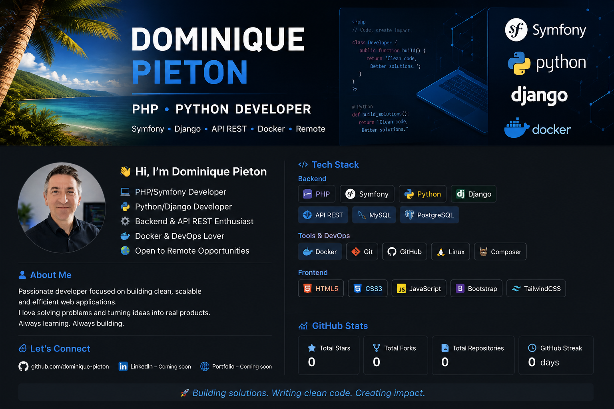

  

# Hi 👋 I'm Dominique Pieton

💻 PHP Symfony Developer  
🚀 Backend & API REST Developer  
🐳 Docker Enthusiast  
🌴 Based in Guadeloupe  
🌍 Open to Remote Opportunities  

---

## 🚀 Tech Stack

### Backend
- PHP 8
- Symfony
- API REST
- MySQL
- PostgreSQL
- Python
- Django

### Tools & DevOps
- Docker
- Git
- GitHub
- GitLab
- Linux
- Composer

### Frontend
- HTML5
- CSS3
- JavaScript
- Bootstrap
- TailwindCSS
- Angular

---

## 📌 Current Goals

- Build modern Symfony applications
- Improve DevOps & Docker skills
- Create scalable REST APIs
- Work on remote international projects

---

## 📫 Contact

- GitHub: https://github.com/dpieton-dev
- LinkedIn: Coming soon
- Portfolio: Coming soon

---

## ⚡ Fun Fact

I love building clean and efficient web applications 🚀
